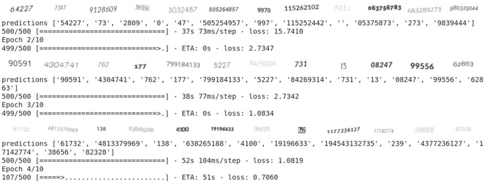

# Simple digit OCR with tf.keras 2.1

Check the related blog post eplanation:  
https://medium.com/@akikutvonen/get-started-with-deep-learning-ocr-136ac645db1d

A Convolutional Recurrent Neural Network (CRNN) OCR baseline in tf.keras 2.1 using only generated training data. This repo should allow to explore different architectures and data domains later using the same template. In the implementation training and inference can accept any length of text and the image width doesn’t need to be defined in advance.


In the current repo we only parse digits for simplicity, but the trdg text generator used in the repo can generate random sentences from Wikipedia for training a more general OCR model. That said, to achieve good performance on more challenging data domains such as noisy images, handwritten text, or text in a natural scene one would need to tune the model and data augmentation methods.  



# How to
To get started, download or clone this github repo and set up a Python environment containing Tensorflow 2.1, trdg (pip install trdg) and Jupyter notebook. You can also set up the environment using Docker following the instructions available later in this readme.  


After the environment is set, open the .ipynb file with jupyter notebook. Execute the first cell to create the model, data generators and compile the model. The second cell will train the model. The third cell will call the inference function to predict the texts in all images placed in the inference_test_imgs/ folder. Training can be also done by "python train.py" inside the main folder but you miss the visual outputs during the training.


## Installation

### TL;DR, Tensorflow 2.1, pip install trdg

### Those needing more support on setting up things with Docker:
Prerequirements
Linux for gpu tensorflow image, if want to use windows from docker, then drop the gpu tag and do training without gpu.
Or another option is to just use your conda environment on Windows with gpu support. In that case skip the docker parts.
Or make an environment by other means. Below instructions for the docker environment setup:  

More info:  
https://www.tensorflow.org/install/docker  

Pull latest docker tensorlow image  
```docker pull tensorflow/tensorflow:latest-gpu-py3-jupyter```

Go the the OCR_simple folder and run the container mounting the current dir to /tf/work  
```docker run -it --rm --gpus all -v  $PWD:/tf/work -p 8888:8888 tensorflow/tensorflow:latest-gpu-py3-jupyter```   

Install some libraries which are not part of the docker container but required (run from notebook cell)  
```!apt-get update```  
```!apt-get install -y libsm6 libxext6 libxrender-dev```

Install the base text generator (run below from notebook cell)  
```!pip install trdg```

Restart jupyter kernel

Save the new docker image so that you don't need to do the above again  
```docker ps``` 
check the CONTAINER ID corresponding to tensorflow/tensorflow tensorflow/tensorflow:latest-gpu-py3-jupyter,
for example 55d87004c378   

Commit to a new image  
```docker commit 55d87004c378 tensorflow:simple_ocr```

Check that the image is created    
```docker images```

Next time start the updated image   
```docker run -it --rm --gpus all -v $PWD:/tf/work -p 8888:8888 tensorflow:simple_ocr```

## Play around with with trdg
list of possible parameters for trdg can be found at   
https://github.com/Belval/TextRecognitionDataGenerator/blob/master/trdg/generators/from_random.py  

To test generater images in jupyter notebook: 

```
from trdg.generators import GeneratorFromRandom  
base_generator = GeneratorFromRandom(use_symbols=False, use_letters=False)
img, lbl = next(base_generator)
display(img)
 ```


## Possible errors 

In case of this error: 
```
    117             y_true[:, 0:max_word_len_batch, 0] = batch_labels
    118             y_true[:, 0, 1] = label_lens
    119             y_true[:, 0, 2] = input_length

ValueError: could not broadcast input array from shape (12,7) into shape (12,6)
```  

You're using too many maxpoolings or others means of dim reduction and the time dimension can not capture 
all the craracters. In another words, time distributed length 6 can not predict 7 characters.